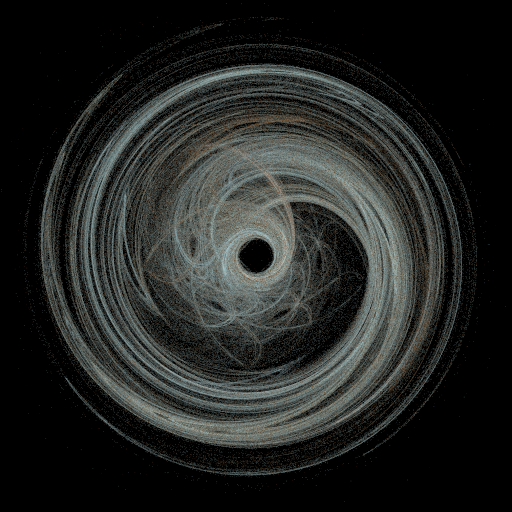

# Fractal Flame Generator

A basic program to generate fractal flames using the fractal flame algorithm by Scott Draves.

## Example

Output of `php fractalflame.php -f CustomFlame1 -c sky-flesh.map -z 0.35 -i 20000000` manually scaled down to 512x512.  

## Setup

- Clone this repo to your local machine
- Install all needed packages using `composer install`

## Usage

Basic usage: `php fractalflame.php -f FlameName`
For more infos and more options see `php fractalflame.php --help`

## Docker

To open an interactive shell run
`docker-compose run dev bash`.  
Everything inside the Project folder is mapped to `/app`.